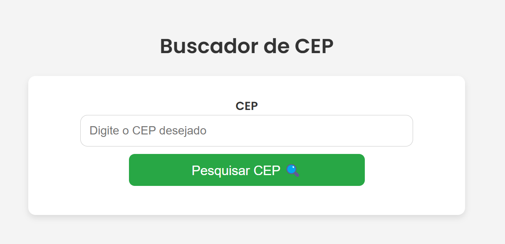

# Web CEP Search System

This project is a CEP search system, developed using ***Python*** and the ***Django framework***. The goal of the system is to allow users to search for CEPs and obtain information such as full address, neighborhood, city and state of Brazil.
<br>

<p align="center">
  <strong>Example images: </strong>
</p>

<p align="center">
  
  <br>
  <span>Image 1: Home</span> <!-- Comentário abaixo da imagem -->
  <br><br>
  
  <br>
  <span>Image 2: Searching</span> <!-- Comentário abaixo da imagem -->
</p>

## Requirements

Before running the project, make sure you have ***Python*** and ***Django*** installed on your machine.

## How to install    

### Run the following command to create a virtual environment:
```bash
python -m venv venv
```

### Access the virtual environment (on Windows) run:
```bash
.\venv\Scripts\activate
```

### With the virtual environment activated, install ***Django***:
```bash
pip install django
```

### The system uses the requests library to make calls to the ZIP code query API, run: 
```bash
pip install requests
```

### With the dependencies installed, start the local server with:
```bash
python .\manage.py runserver
```

### To cancel the server execution, simply press:
```bash
CTRL + C
```
<br>

# Feel free to experiment
### Just clone the repository
```bash
git clone https://github.com/Luan-Marchiotto/zip-code-search.git
```
### In the cloned repository folder enter:
```bash
git clone https://github.com/Luan-Marchiotto/zip-code-search.git
```
## Languages and Technologies Used:


